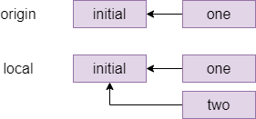
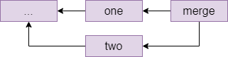
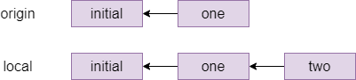
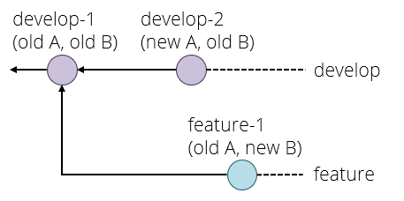
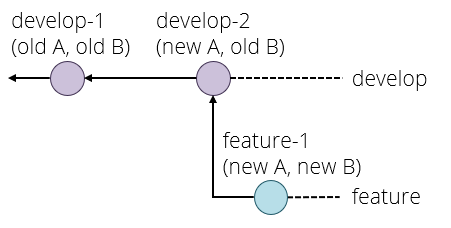

# Collaborating with shared access

For this exercise you need to work in a group of at least two people. Have one
person create a private repository on a Git forge like `github.com` (tick the
box to add a README file) and add everyone else in the group to the repository.
You all need to have an account with the same provider for this to work.

  * On Github, the way to add people to a repository is on the repository page: choose _Settings_ in the top menu, then _Manage access_. Here you can press _Invite a collaborator_ and enter their Github username. This causes Github to send them an e-mail with a link they need to click to accept the invitation and be added to the repository. _Note: you must be logged in to GitHub when you click the link on the invitation e-mail, otherwise you will get an error message._

Everyone should then `git clone` the repository to their own machine. You are
now going to practice working together using the same remote repository, in a
variety of different workflows.


## Conflict avoidance

We are going to start with a 'conflict avoidant' workflow, which is a fairly
silly workflow that does not really make good use of version control -- it's
more like how you would work _without_ version control.

Everyone does the following, one person at a time doing all steps (coordinate
among each other, so Person 1 does all steps, then Person 2 does all steps,
etc.):

  1. First, make sure your terminal is in the folder with your working copy, and
     type `git pull`.
      * If you get no update, then there were no changes on the remote and you
        are ready to start coding. (This should happen to the first person to
do this step.)
      * If you get output, then there were changes on the remote. Because of the
        'conflict avoidance' strategy here, you should see your local repository
gets 'fast-forwarded' to include all the changes from the remote. 
      * Do a `git log` too to see the last person's commit message.
  2. Do some coding: make a change to the repository - add or change a file,
     then commit your changes. 
  3. Run the following push workflow to push your changes to the remote:
     1.  Do a `git pull` to see if there were any remote changes (there
         shouldn't be, for this exercise).
     2. Do a `git push` to send your changes to the remote.

You can now code as a team, as long as only one person at a time is working.
Because everyone works in sequence, and downloads changes before starting their
work, there is no risk of creating conflicting edits. This is however clearly a
very poor way to handle development -- at least half of your development team is
stuck doing nothing at any one time.


## Conflict resolution, part one

A more sensible approach to collaboration is to work simultaneously on edits,
and use your version control software to help integrate changes. This treats
people working on different local repositories connected to the same remote a
bit like they are working on different branches.   

First, everyone should execute `git pull`, so they are up to date with the
remote. Then:

 1. Every team member should simultaneously make some edits and commit them to
    their local versions of the repository.
 2. When a team member has finished and committed their changes, they should
    execute `git pull`. Depending on what has happened so far elsewhere in the
team:
      * If there is no update, there are no changes on the remote yet, and this
        team member can proceed to `git push` their changes -- they got their
changes completed first, so they don't have to merge anything.
      * If there _is_ an update on the remote, what happens next depends on
        whether the edit is **in conflict** with an edit made in the local
repository -- if two team members edited the same lines of the same file. 

**If there is no conflict**, Git will create a commit to automatically merge the
two versions, opening the user's text editor with a new commit message to mark
this. Once this is saved, the team member should be able to `git push` this
updated version to the remote.

**If there is a conflict**, the team member will see a message something like
the below.

```
CONFLICT (add/add): Merge conflict in README.md
Auto-merging README.md
Automatic merge failed; fix conflicts and then commit the result.
```

This is Git explaining that there is a conflict between two edits to a file (or
multiple files). If you open up the affected file (in this example, README.md),
then you will see that Git has edited the file to show the two versions it was
presented with.

    <<<<<<< HEAD
    Created by NAME2.
    =======
    Created by NAME1.
    >>>>>>> b955a75c7ca584ccf0c0bddccbcde46f445a7b30

The lines between `<<<<<<< HEAD` and `=======` are the local changes (made by
the team member that called `git pull`) and the ones from `======` to `>>>>>>
...` are the ones in the commit fetched from the remote, for which the commit id
is shown.

This team member now has to resolve the conflict by editing the file to produce
the version they would like to commit. In this example, you could remove all the
offending lines and replace them with `Created by NAME1 and NAME2.`

One all the conflicts in this merge attempt have been resolved (remember,
multiple conflicts can occur in a file, and there can be conflicts in more than
one file), the team member handling the merge can `git add` all the files with
changes and `git commit` to explain how they handled the conflict. Git will
pre-populate the commit message with a short description.

This team member can then attempt to `git push` to synchronise the merge to the
remote -- though if they took a while to resolve the merge, they may need to
`git pull` again in case there are _more_ changes on the remote they need to
merge.

We *strongly* recommend that your team take **several passes** through this
workflow, coordinating your edits so that every team member has the chance to
handle a merge conflict at least once.

## Conflict resolution, part two

The `git pull` command we are using is actually executing two distinct steps
under the hood. The first is `git fetch`, to retrieve changes from the remote,
and the second is `git merge`, to integrate those changes into the local
repository. Merging is a common method for dealing with diverged branches or
repositories, but it is not the only one. An alternative is to `rebase` local
changes on top of updates from the remote.

That is, a `merge` takes a situation like this:



And produces a graph like this, with a new commit connecting the diverged
versions:



The alternative, rebasing, is pretending that they had actually fetched the
`one` commit before starting their own work. The command for this is `git rebase
[branch]` which means _pretend that everything in [branch] happened before I
started my local changes_, and gives the following graph:




To try out rebasing:

 1. Have one team member edit, commit, and push a change to the remote
    repository.  
 2. Have a second team member make some edits and commit them locally (possibly
    several commits). 
 3. Have the second team member execute `git fetch` to retrieve information about
    the changes on the remote.
 4. Then, this team member should execute `git rebase origin/main` (assuming
    'main' is your remote default branch). The commits made locally will be
replayed on top of the changes retrieved from the repo, creating a more linear
timeline. 

If this goes smoothly (there are no conflicts) the rebase will complete without
issue. If there *are* conflicts, you will enter a similar state as with merge
conflicts above. Rather than committing a merge, however, conflicted files will 
need to be edited, and then the rebase should be resumed with:

```bash
git add [file]
git rebase --continue
```

You will also find that you may be asked to edit the commit messages for old
commits -- because your rebased commit may need to be explained differently.

This should continue until the rebase finishes with a message:

    Successfully rebased and updated refs/heads/[branch]

Different companies and teams have different opinions on when a rebase makes
sense: some places forbid rebasing like this entirely, at least for work that is
genuninely shared between different people. There is more or less a general
consensus that you should not rebase when different people were editing the same
files, but it is a technique worth knowing about for conflicts like the one you
just created where different people have edited different files, as it makes for
a cleaner commit graph. 

Try out rebasing a few times and try to understand the difference from your
earlier merges.

If you look at the repository's page on Github
(`https://github.com/USERNAME/REPONAME`, where `USERNAME` is the name of the
user who created the repository), then you can click on _Insights_ in the top
bar then _Network_ on the left menu to see the commit history for the repository
as a graph. Hovering over a commit node shows the committer, the message and the
commit hash - and clicking on a node takes you to a page where you can see which
changes were made in this commit.

On the main Github page for the repository, you can also click the clock icon
with a number in the top right (on a wide enough screen it also shows the word
_commits_) to go to a page showing all the commits on your repository in
chronological order.

If you decide that you prefer rebasing to merging as a default, you can call
`git config --global pull.rebase true` to make this the default action that
takes place when you `git pull`, saving you from having to manually `git fetch`
and `git rebase`. You can also make this choice differently for different
repositories by ommitting the `--global` flag. 


## Coordination using development branches 

The workflows we discuss above involved developers merging or rebasing changes
directly into the default branch on a remote. In many large software projects,
this isn't feasible -- there are too many concurrent lines of development taking
place for everyone to be resolving changes on one branch. 

One option we have discussed is using branches locally, and then merging or
rebasing coherent changes into the default branch. However, if you need to share
what is going on on a branch (to get help on a problem, or show your boss your
progress, or back up your work), this also is insufficient -- we need to push our
branches to the remote as well.

In practice, a lot of software projects use branches as an organisation system
for approving changes, with updates to the default branch made only certain
conditions. 

### Set-up

One member makes a Git repository on one of the online providers, adds the other team members and shares the cloning URL. Everyone clones the repository.

The repository must have at least one commit for the following to work. This condition is satisfied if you chose your provider's option to create a README file; if not then make a file now, commit it and push.

### The develop branch

By default, your repository has one branch named `main`. But you don't want to do your work on this branch directly. Instead, one team member creates a `develop` branch with the command

    git branch develop
    git switch develop

The team member who created the develop branch should now make a commit on it.

This branch currently exists only in their local repository, and if they try and push they would get a warning about this.
What they need to do is

    git push --set-upstream origin develop

This adds an "upstream" entry on the local develop branch to say that it is linked to the copy of your repository called `origin`, which is the default name for the one you cloned the repository from.

You can check this with `git remote show origin`, which should display among other things:

    Remote branches:
      develop tracked
      main  tracked
    Local branches configured for 'git pull':
      develop merges with remote develop
      main  merges with remote main
    Local refs configured for 'git push':
      develop pushes to develop (up to date)
      main  pushes to main  (up to date)

Everyone else can now `git pull` and see the branch with `git branch -a`, the `-a` (all) option means include branches that only exist on the remote. They can switch to the develop branch with `git checkout develop`, which should show:

    Branch 'develop' set up to track remote branch 'develop' from 'origin'.
    Switched to a new branch 'develop'

### Feature branches

Every team member now independently tries the following:

  - Make a new branch with `git branch NAME`, choosing a unique name for their feature branch.
  - Make a few commits on this branch.
  - Push your feature branch with `git push --set-upstream origin NAME`.
  - Make a few more commits.
  - Do a simple `git push` since you've already linked your branch to `origin`.

Since everyone is working on a different branch, you will never get a conflict this way.

Anyone who is a project member can visit the GitHub page can see all the feature branches there, but a normal `git branch` will not show other people's branches that you've never checked out yourself. Instead, you want to do `git branch -a`  again that will show you all the branches, with names like `remotes/origin/NAME` for branches that so far only exist on the origin repository. You can check these out like any other branch to see their contents in your working copy.

### Merging

When a feature is done, you want to merge it into develop. Everyone should try this, the procedure for this is:

  1. Commit all your changes and push.
  2. Fetch the latest changes from origin (a simple `git fetch` does this).
  3. `git switch develop`, which switches you to the develop branch (the changes for your latest feature will disappear in the working copy, but they're still in the repository). You always merge into the currently active branch, so you need to be on `develop` to merge into it.
  4. `git status` to see if someone else has updated develop since you started your feature. If so, then `git pull` (you will be _behind_ rather than _diverged_ because you have not changed develop yourself yet).
  5. `git merge NAME` with the name of your feature branch.
  6. Resolve conflicts, if necessary (see above).
  7. `git push` to share your updated `develop` branch with the rest of the team.

If no-one else has changed `develop` since you started your branch, or if you have only changed files that no-one else has changed, then the merge might succeed on the first attempt. It's still a good idea to check that the project is in a good state (for example, compile it again) just in case, and fix anything that's broken on the develop branch.

If the merge fails with a conflict, then you need to manually edit all the conflicted files (git will tell you which ones these are, do `git status` if you need a reminder) and `git commit` again.

The workflow for merging and resolving conflicts is essentially the same as when everyone was pushing changes to `main`, but since everyone is developing on a separate branch, the only time when you have to deal with a possible merge conflict is when you are merging your changes into `develop` - your own branches are "private" and you don't have to worry about hitting a conflict if you quickly want to commit and push your changes as the last thing you do before going home at the end of a long day's work.

Once the `develop` branch reaches a certain level of maturity, someone then takes responsibility for merging `develop` into `main` and pushing that update to the repo. Under this model, you would only do this for a stable update to the codebase, like the next version intended for general release.

### Applying force

There is just one complication left. Suppose the following happens:

  - Your project starts out with commit `develop-1` setting up the initial version of the develop branch. Imagine there are two files, A and B.
  - You create a feature branch and make a commit `feature-1` which changes only file B.
  - In the meantime, someone else makes a feature that changes file A, and merges it as `develop-2` to the develop branch.

You are now in the situation that `develop-2` has (new A, old B) and your `feature-1` has (old A, new B). Neither of these is what you want, you presumably want (new A, new B). We have met this situation before, but without branches. Graphically:



The solution here is to _rebase_ your branch onto the latest commit on develop with `git rebase develop` and fix any conflicts that that causes, which produces the following situation:



If you now try and push your feature branch, you might get an error because the version of your feature branch on the origin repository still has the old version. The solution here is to force the push, which overwrites the old version, with

    git push --force origin BRANCHNAME

This is a _think before you type_ kind of command because it can break things for other developers if you do it on a shared branch. The basic safety rules are:

  - Only rebase on _private_ branches.
  - Only force push on _private_ branches, and only if it is absolutely necessary (for example to tidy up a rebase).

A private branch is one that you know no-one else is working on, for example your own feature branches.

If you ever get into a situation where you need to rebase or force push on a shared branch such as develop or main, you generally need to make sure that everyone on the team knows what is going on, synchronises their repositories both before and after the dangerous operation, and does not make any commits or pushes while someone is working on it - basically they need, in concurrency terms, an exclusive lock on the whole repository while doing this operation.

This is one reason why the main and develop branches are kept separate - and some workflows even include a third branch called `release`. If merges into main or release only ever come from the develop branch, then a situation where you need to rebase these branches can never happen.

