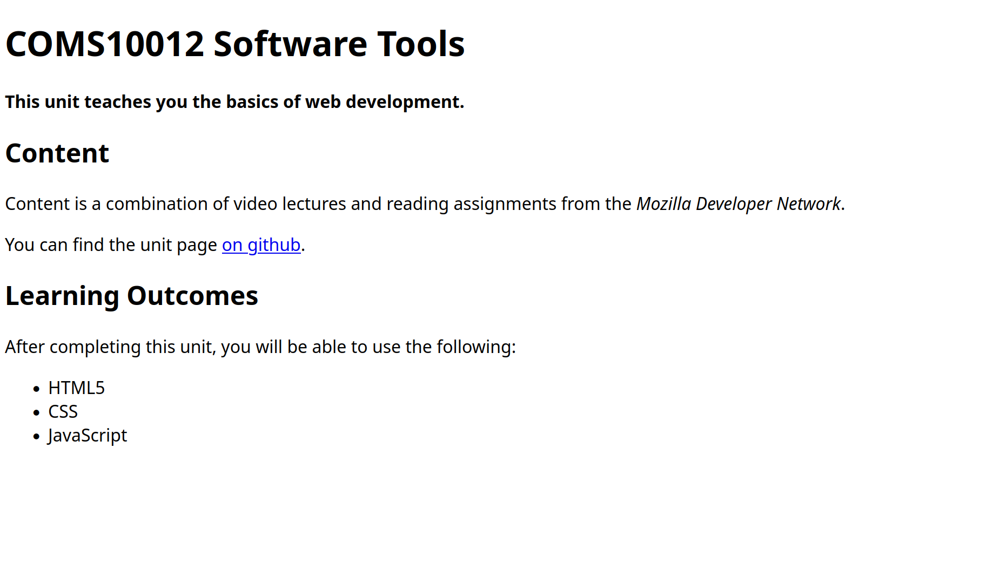

# Basic HTML5

For your first exercise, create a page called `index.html` and add HTML5 template code you've seen from the pre-reading to it.

The name `index.html` is a convention: most web servers, if you give an URL that looks like a "folder" e.g. `example.com/pages` (or `example.com/pages/` with slash on the end) will serve the file `index.html` from within that folder, if there is one.

## Create a page

Create content in your page to make it look like the following, then open it in your browser. All body text, but not the bullet list, is contained in paragraph tags.

## Validate your page

There are various libraries and services that check if your page is valid HTML5.

At [validator.w3.org](https://validator.w3.org/) you can enter an URL, upload a file, or paste the contents of a file and validate it. Check that the page you have just written is valid HTML5.

Your browser's developer tools can also check the page you are viewing. For Chrome/Edge, go to the _Console_ tab and, if the button at the top does not read _No Issues_ but shows a number with a blue (or even yellow or red) icon, then click it to open the _Issues_ tab and see what the browser is complaining about.

You can check the sample solution [here](./examplepage.html) but you might have a different, equally valid solution.
